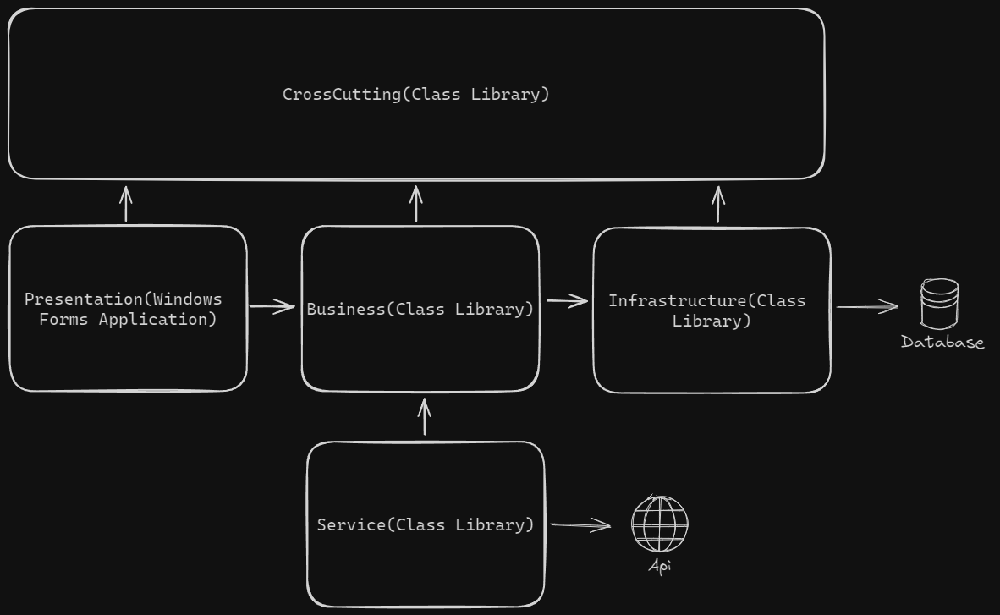
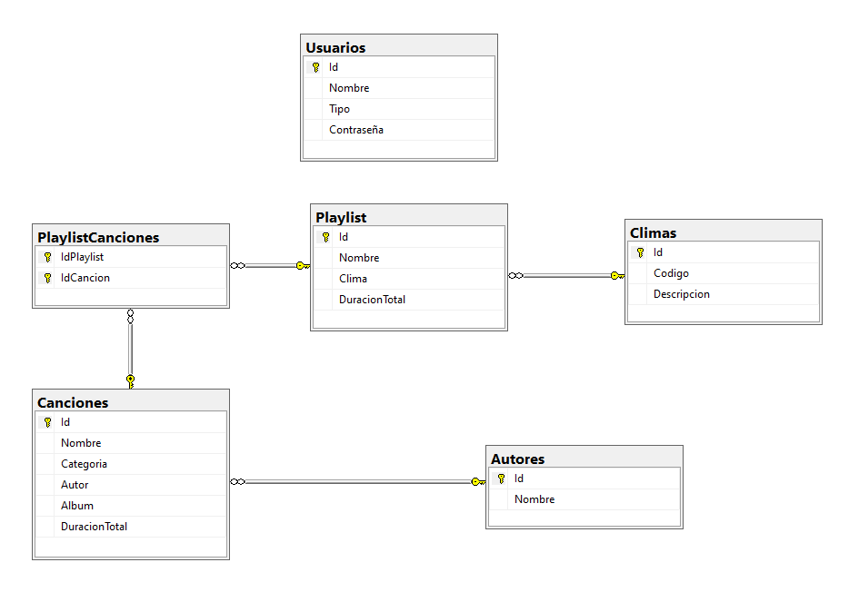

# AppMusic

AppMusic es una aplicación para reproducir música, desarrollada con .NET Framework. Esta aplicación permite escuchar música de forma sencilla e incluye la opción de selección automática basada en el clima, utilizando una API gratuita. La aplicación permite gestionar todas las canciones, artistas y listas de reproducción.

## Arquitectura

El proyecto está estructurado en diferentes capas y bibliotecas de clases que interactúan entre sí para manejar las funciones de la aplicación. A continuación, se detallan los componentes principales.



## Instalación

### Requisitos basicos

- SDK .NET 8.0 o superior
- SQL Server u otro servidor compatible
- API key de Openweathermap

### Pasos

1. **Clona el repositorio**:
    ```bash
    git clone https://github.com/frackfernandez/AppMusic.git
    cd AppMusic
    ```

2. **Restaura las dependencias**:
    ```bash
    dotnet restore
    ```

3. **Configura la cadena de conexión de la base de datos:**

    Abre el archivo `ConnectionDB.cs` en la carpeta `Infrastructure` y actualiza la cadena de conexión.
    
4. **Configura las credenciales de la API:**

    Abre el archivo `ServiceWeather.cs` en la carpeta `Service` y actualiza las credenciales.

5. **Crea la base de datos:**

El diagrama de la base de datos ilustra la estructura de las tablas y sus relaciones.



6. **Compila el proyecto**:
    ```bash
    dotnet build
    ```

## Contribuciones

Se agradecen las contribuciones. Por favor, sigue el proceso habitual en GitHub para realizar un fork, crea una rama, haz los cambios y envía un pull request.

## Licencia

Este proyecto está bajo la [MIT License](https://opensource.org/licenses/MIT).